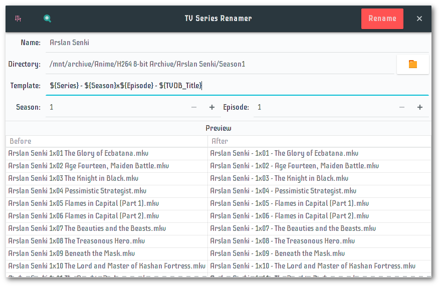
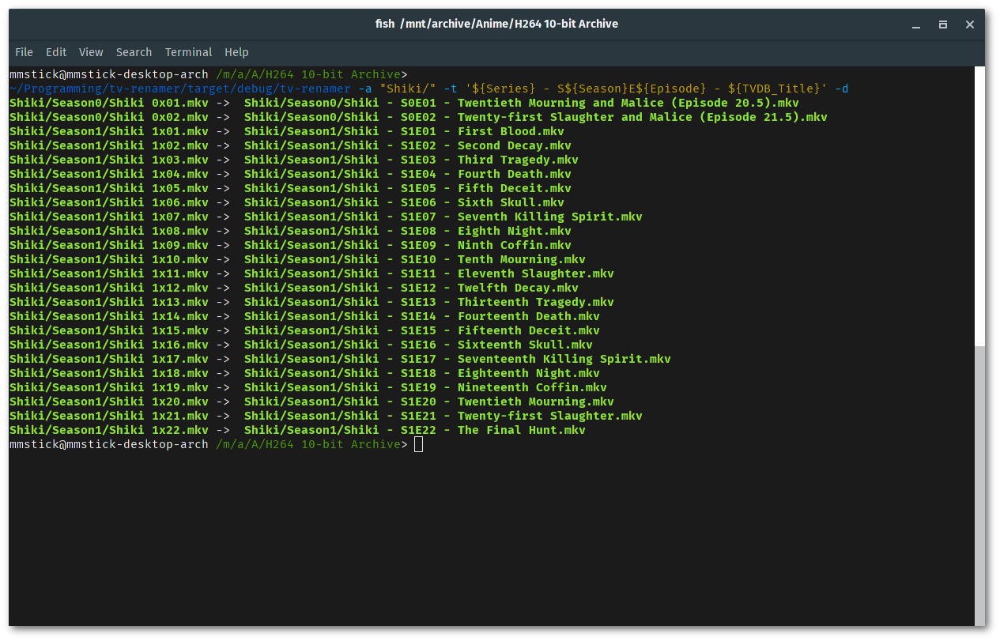

**Build Status:** [](https://travis-ci.org/mmstick/tv-renamer)

# Features

- Written safely in Rust!
- Detection of video content only via /etc/mime.types
- Templates to customizing naming schemes
- TVDB Support for obtaining episode titles from TheTVDB
- Automatically inferring series titles based on directory path
- Ability to rename multiple seasons and specials
- CLI and GTK3 interfaces
- Busybox-style binary

# Installation Instructions

This project is using a Makefile for generating a busybox-style binary, named **tv-renamer**, which provides two options: **cli** and **gtk**. The default make option will build the binary with the GTK3 interface feature enabled. To build without the GTK3 interface, use `make cli` instead of `make`.

## With GTK3 Enabled

```sh
make && sudo make install-gtk
```

## CLI-only

```sh
make cli && sudo make install-cli
```

# GTK3 Manual



The use of this application should be fairly straightforward. The program uses the /etc/mime.types file to only detect videos in a given directory, and does not make a distinction between what is or is not part of the series, so ensure that the only video files in the directory that you are renaming contains the episodes that you are wanting to rename, and ensure that the episodes are in alphabetical order. The application does not derive the episode number from the episode name, but by their alphabetical order in the directory.

- **Season Name**: The name of the TV series to be renamed.
  - This will be automatically inferred from the directory path if no name is set.


- **Season Directory**:
  - If **Automatic** is enabled, set this to the base directory of the TV series.
  - Otherwise, set this to the season directory that you are currently renaming.


- **Template**: Defines the naming scheme to use when renaming episodes.


- **Season Number** and **Episode Number**: Defines what index to start counting from.
  - These are ignored when **Automatic** is enabled.


- **Log Changes** will simply log changes that have been performed on the disk.


- **Automatic**: Rename all seasons within a TV series directory.

The directory structure for **Automatic** should be as follows:

> Series Title/Specials/{Episodes...}

> Series Title/Season 1/{Episodes...}

> Series Title/Season 2/{Episodes...}

# CLI Manual

If you need help with the usage of the CLI application, this manual page is also included in the program and is invokable with the -h and --help flags. The CLI interface is invoked by executing `tv-renamer cli`, followed by your arguments of choice.



## NAME:

**tv-renamer** - rename TV series and movies

## DESCRIPTION:

Renames all videos in a directory according to their season number and episode count. Please ensure that all of the files in the directory are files that you want renamed. It is recommended to use the dry-run option first before committing any changes.

If no DIRECTORY is given, the default path will be the current working directory. If a target file already exists, the command will skip the file.

## OPTIONS:

**-a, --automatic**: Automatically infer the season name and number based on the directory structure.

**-d, --dry-run:** Runs through all of the files and prints what would happen without doing anything.

**-l, --log-changes:** Log changes made to the disk to a file in your home directory.

**-n, --series-name:** Sets the name of the series to be renamed. [not optional]

**-s, --season-number:** Sets the season number to use when renaming a file. [default: 1]

**-t, --template:** Sets the template that will define the naming scheme. [default: "${Series} ${Season}x${Episode} ${TVDB_Title}"]

**-e, --episode-start:** Sets the episode number to start counting from. [default: 1]

**-p, --pad-length:** Sets the number of digits to pad the episode count for. [default: 2]

**-v, --verbose:** Print the changes that are occurring.

## EXAMPLE:

When executed inside of a directory with the name of the TV Series

```
one.mkv two.mkv three.mkv
> tv-renamer cli -n "series name"
"TV Series 1x01 Episode Title.mkv"
"TV Series 1x02 Episode Title.mkv"
"TV Series 1x03 Episode Title.mkv"
```

You can define your own naming scheme with --template:

```
> one.mkv two.mkv three.mkv
> tv-renamer cli -t "${Series} S${Season}E${Episode} - ${TVDB_Title}"
> "TV Series S1E01 - Episode Title.mkv" "TV Series S1E02 - Episode Title.mkv" "TV Series S1E03 - Episode Title.mkv"
```

The season name can also be automatically inferred:

```
"$series/Season1" "$series/Season2"
> tv-renamer cli "$series" -a OR cd $series && tv-renamer cli -a
"TV Series/Season1/TV Series 1x01.mkv"
...
"TV Series/Season2/TV Series 2x01.mkv"
...
```

Episode titles can also be pulled from the TVDB and added to the filenames.

```
> tv-renamer cli -a -t "${Series} ${Season}x${Episode} ${TVDB_Title}"
"TV Series/Season1/TV Series 1x01 Episode Title.mkv"
```

## AUTHOR:

Written by Michael Aaron Murphy.
